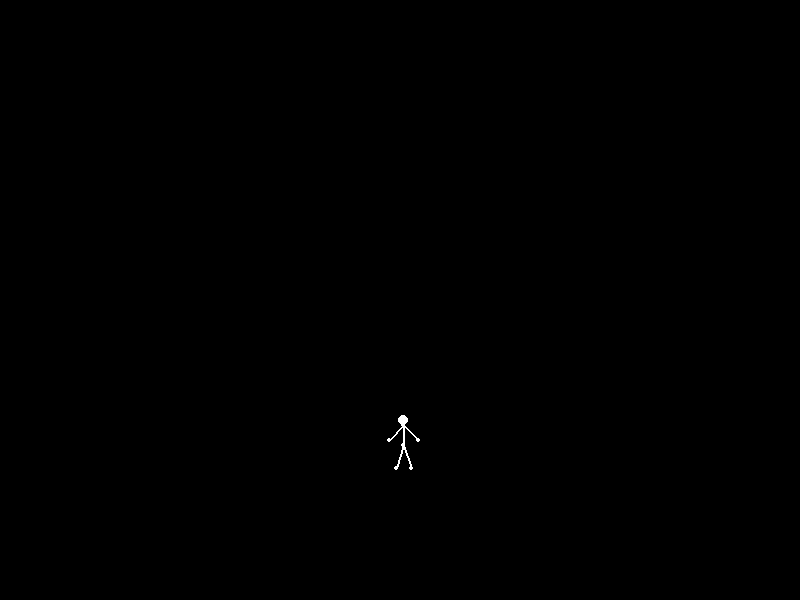

# Ragdoll Physics

An interactive 2D ragdoll built from point masses, springs, dampers and distance constraints.



## What it contains

- Verlet-style position integration with gravity and drag.
- Spring-damper joints and fixed-length constraints.
- A draggable ragdoll with keyboard forces.

## Setup

Use Python 3.12. From the repository folder:

```bash
python -m venv .venv
# Windows PowerShell: .venv\Scripts\Activate.ps1
# macOS / Linux: source .venv/bin/activate
python -m pip install -r requirements.txt
python main.py
```

## Controls

Hold the mouse button to move the torso. A / D apply horizontal forces; Space applies an upward impulse-like force.

## Project status

An exploratory physics demo. Its timestep and constants are chosen for the supplied scene.

## Project collection

Part of [lnivan's projects](https://github.com/lnivan), under **Simulations**.
