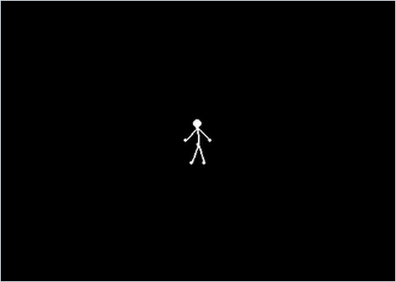

<div align="center">

# Ragdoll Physics

*A 2D stick-figure ragdoll made of seven point masses, rigid sticks and damped springs, stepped with position Verlet.*




</div>

## About

An interactive ragdoll written from scratch. NumPy does the physics, and Pygame only opens the window, reads input and draws circles and lines. The figure has seven point masses: head, chest, hip, two hands and two feet. Rigid sticks form the trunk and limbs, and six invisible spring-dampers brace the hands and feet so it can stand on its own. Gravity (on every point except the head), air drag and a floor with friction act on the body. You can pick the figure up by the chest, drop or fling it, push it sideways and make it jump.

## Quick start

```bash
python -m pip install -r requirements.txt
python main.py
```

## Controls

| Input | Action |
| --- | --- |
| Hold any mouse button | Grab the chest: it snaps to the cursor and follows it, with gravity off |
| Release the button | Drop the figure; it keeps the motion of the last drag step |
| <kbd>A</kbd> / <kbd>D</kbd> (hold) | Push every point left / right at 10 units/s² |
| <kbd>Space</kbd> | Jump: every point gets 2500 units/s² upwards for one step, and the console prints `Salto` ("jump") |
| Close the window | Quit |

## How it works

- **World and camera.** Positions are in world units with y pointing up. The camera draws 50 px per unit, so the 800 × 600 window shows 16 × 12 units, and the floor $y = 0$ is the bottom edge.
- **Position Verlet.** Each point stores its current and previous position, and every frame advances a fixed $\Delta t = 0.002$ s. Velocity is never integrated; it is read back from the positions:

  ```math
  \mathbf r_{n+1} = 2\mathbf r_n - \mathbf r_{n-1} + \frac{\mathbf F}{m}\,\Delta t^2,\qquad \mathbf v = \frac{\mathbf r_{n+1} - \mathbf r_n}{\Delta t}
  ```

- **Forces.** Gravity $-mg\hat{\mathbf y}$ with $g = 9.81$ acts on every point except the head, which is created with gravity off. Linear air drag is $-0.7\mathbf v$. A spring-damper between points 1 and 2 acts along $\mathbf d = \mathbf r_2 - \mathbf r_1$, combining Hooke's law with a damper on the relative velocity:

  ```math
  \mathbf F_1 = \Bigl[k\bigl(\lVert\mathbf d\rVert - L\bigr) + c\,(\mathbf v_2 - \mathbf v_1)\cdot\hat{\mathbf d}\Bigr]\,\hat{\mathbf d},\qquad \mathbf F_2 = -\mathbf F_1
  ```

- **Rigid sticks.** A fixed-length joint is a position correction, not a force. Each step, after the forces are summed, every stick moves its two ends along $\hat{\mathbf d}$ until they are $L$ apart again. Each end's share is set by its inverse mass $w_i = 1/m_i$, so the lighter end moves more:

  ```math
  \delta = L - \lVert\mathbf d\rVert,\qquad \mathbf r_1 \leftarrow \mathbf r_1 - \frac{w_1}{w_1 + w_2}\,\delta\,\hat{\mathbf d},\qquad \mathbf r_2 \leftarrow \mathbf r_2 + \frac{w_2}{w_1 + w_2}\,\delta\,\hat{\mathbf d}
  ```

  Because Verlet reads velocity from positions, the correction also changes the velocities, so no separate impulse is needed.
- **Body plan.** There are seven sticks, and five of them are drawn. The six hidden spring-dampers join hand to foot, hand to hand, foot to foot and the chest to each foot, with $k$ from 50 to 10 000 and $c$ from 25 to 150.
- **Floor.** A point that goes below $y = 0$ is put back on it and its vertical motion is cancelled. On the next step it also gets a sliding-friction force $-10 m v_x$.
- **Dragging.** While a button is held, the chest's position is overwritten with the cursor's world position every frame. Verlet turns that displacement into velocity, so letting go during a quick drag throws the figure.

## Code map

| Path | Role |
| --- | --- |
| `main.py` | Builds the figure from points, sticks and spring-dampers, reads input and runs the loop |
| `fisica.py` | Physics (`fisica`): `Physics_System` with its `Point`, `Spring`, `Damper`, `Spring_Damper_Joint` and `Fixed_Joint` classes |
| `draw.py` | `Drawer`: world-to-screen transform, points as circles and joints as lines |

## Limitations

- Each frame advances the simulation by a fixed 0.002 s and then sleeps 2 ms, with no clock, so the speed depends on the machine.
- The floor is the only obstacle. There are no walls, so a hard throw sends the figure off screen, where it stays unless <kbd>A</kbd> / <kbd>D</kbd> push it back. Body parts pass through each other.
- Each stick is corrected once per step, with no repeated passes, so the sticks are only approximately rigid. In a headless test they stretched by about 10 % on the first landing, and far more while the chest was dragged quickly.
- On release the code sets the chest's velocity from `pygame.mouse.get_rel()`, but Verlet recomputes it on the next step, so that value only feeds one step of drag and damping.
- The figure, masses and stiffnesses are hard-coded in `main.py`, which also keeps two alternative bracing setups as commented-out blocks.

## Background

Written on 11–12 February 2026 in a folder called `juego_epico` ("epic game"). The five original commits, all from 12 February, go from a first point-and-spring system to separate spring-damper and fixed joints.

---

<div align="center"><sub>Part of <a href="https://github.com/lnivan">lnivan's projects</a> · <b>Simulations</b></sub></div>
